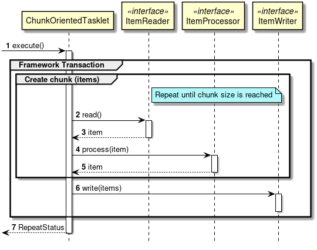

# Chunk Model 알아보기 

- Chunk Model은 처리할 데이터를 일정단위(청크) 로 처리하는 방식이다. 
- ChunkOrientedTasklet 은 청크 처리를 지원하는 Tasklet의 구체적인 클래스 역할을 수행한다. 
- 청크에 포함될 데이터의 최대 레코드 수(청크 Size), 는 본 클래스의 commit-interval이라는 설정값을 이용하여 조정이 가능하다. 
- ItemReader, ItemProcessor, ItemWriter 는 청크 단위를 처리하기 위한 인터페이스이다. 



- 위 시퀀스 다이어그램과 같이 ChunkOrientedTasklet 은 ItemReader, ItemProcessor, ItemWriter 구현체를 각각 호출한다. 
- 이때 ChunkOrientedTasklet 은 청크 단위에 따라 ItemReader, ItemProcessor, ItemWriter 를 반복실행한다. 
- 1. 청크 크기만큼 ItemReader가 데이터를 읽어 들인다. 
- 2. 청크 단위를 ItemProcessor로 전달하고, 데이터를 처리한다. 
- 3. ItemProcessor를 처리하고난 청크 단위가 ItemWriter로 전달되어 데이터를 저장하거나, 파일처리를 수행한다. 

## ItemProcessor

- ItemProcessor은 구체적인 구현체를 구현하여 스프링배치에 전달한다. 
- ItemProcessor은 Reader로 읽어들인 청크 데이터들을 처리한다. 처리라고 하면, 데이터를 변환하거나, 데이터에 변경 혹은 외부 인터페이스 호출등을 수행하는 역할을 한다. 
- ItemProcessor은 chunk model에서 없어도 되는 옵션이다. 

```kt
class MyItemProcessor : ItemProcessor<MyInputObject, MyOutputObject> {  // (1)
    @Throws(Exception::class)
    override fun process(item: MyInputObject): MyOutputObject {  // (2)

        val processedObject = MyOutputObject()  // (3)

        // Coding business logic for item of input data

        return processedObject  // (4)
    }
}
```

- (1): ItemProcessor 인터페이스를 구현하게 된다. 이때 입력, 출력 데이터 타입을 제네릭 타입으로 받는다. 
- (2): process메소드 구현체를 구현하며, 입력 아규먼트로 받아 들인다. 
- (3): ItemProcessor 처리 결과로 반환할 출력 객체를 생성한다. 즉, 변환된 데이터 등이 올 수 있다. 
- (4): 출력 객체를 반환한다. 

## ItemReader 

- ItemReader는 직접 커스텀 구현을 할 수 있지만 스프링배치에서는 이미 구현된 다양한 ItemReader구현체를 제공한다. 

### 제공하는 다양한 구현체

- FlatFileItemReader:
  - 플랫파일 (즉 구조화 되지 않은파일을 플랫파일이라고한다.)을 읽어 들인다. 
  - 대표적인 것이 CSV파일 등이 있다. 
  - 읽어들인 데이터를 객체로 매핑하기 위해서 delimeter를 기준으로 매핑 룰을 이용하여 객체로 매핑한다. 
  - 혹은 입력에 대해서 Resource object를 이용하여 커스텀하게 매핑할 수도 있다. 
- StaxEventItemReader:
  - XML파일을 읽어 들인다. 
  - 이름이 함축하듯이 XML파일을 StAX기반으로 읽어 들인다. 
- JdbcPagingItemReader / JdbcCursorItemReader:
  - JDBC를 사용하여 SQL을 실행하고 데이터베이스의 레코드를 읽는다. 
  - 데이터베이스에서 많은 양의 데이터를 처리해야 하는 경우에는 메모리에 있는 모든 레코드를 읽는 것을 피하고, 한 번의 처리에 필요한 데이터만 읽고 폐기하는 것이 필요하다. 
  - JdbcPagingItemReader는 JdbcTemplate을 이용하여 각 페이지에 대한 SELECT SQL을 나누어 처리하는 방식으로 구현된다. 
  - 반면 JdbcCursorItemReader는 JDBC 커서를 이용하여 하나의 SELECT SQL을 발행하여 구현된다. 
- MyBatisCursorItemReader / MyBatisPagingItemReader:
  - MyBatis를 사용하여 데이터베이스의 레코드를 읽는다. 
  - MyBatis가 제공하는 Spring 조정 라이브러리는 MyBatis-Spring에서 제공된다. 
  - Paging과 Cursor의 차이점은 MyBatis를 구현방법이 다를뿐이지 JdbcXXXItemReader과 동일하다 
  - 또한 ItemReaderJPA구현이나 Hibernate와 연동하여 데이터베이스의 레코드를 읽어오는 JpaPagingItemReader, HibernatePagingItemReader, HibernateCursor를 제공한다. 
- JmsItemReader / AmqpItemReader:
  - 메시지를 JMS혹은 AMQP에서 읽어들인다. 

## ItemProcessor

- ItemReader와 마찬가지로 Spring Batch에는 다양한 ItemProcessor 구현체도 제공한다. 

### 제공하는 다양한 구현체 

- PassThroughItemProcessor:
  - 아무 작업도 수행하지 않는다. 
  - 입력된 데이터의 변경이나 처리가 필요하지 않는경우 사용된다. 
- ValidatingItemProcessor:
  - 입력된 데이터를 체크한다. 
  - 입력 확인 규칙을 구현하려면 Spring Batch 전용 org.springframework.batch.item.validator.Validator를 구현해야한다. 
  - 그러나 일반적인 org.springframework.validation.Validator 의 어댑터인 SpringValidator와 org.springframework.validation의 규칙을 제공한다. 
- CompositeItemProcessor:
  - 동일한 입력 데이터에 대해 여러 ItemProcessor를 순차적으로 실행한다. 
  - ValidatingItemProcessor를 사용하여 입력 확인을 수행한 후 비즈니스 로직을 실행하려는 경우 활성화 된다. 

## ItemWriter

- 역시 ItemWriter의 다양한 구현체를 제공한다. 

### 제공하는 다양한 구현체 

- FlatFileItemWriter:
  - 처리된 Java객체를 CSV 파일과 같은 플랫 파일로 작성한다. 
  - 파일 라인에 대한 매핑 규칙은 구분 기호 및 개체에서 사용자 정의로 사용할수도 있다. 
- StaxEventItemWriter:
  - XML파일로 자바 객체를 쓰기할 수 있다. 
- JdbcBatchItemWriter:
  - JDBC를 사용하여 SQL을 수행하고 자바 객체를 데이터베이스에 쓰기한다. 
  - 내부적으로 JdbcTemplate를 사용하게 된다. 
- MyBatisBatchItemWriter:
  - Mybatis를 사용하여 자바 객체를 데이터베이스로 쓰기한다. 
  - MyBatis-Spring 는 MyBatis에 의해서 제공되는 라이브러리를 이용한다. 
- JmsItemWriter / AmqpItemWriter:
  - JMS혹은 AMQP로 자바 객체의 메시지를 전송한다. 

