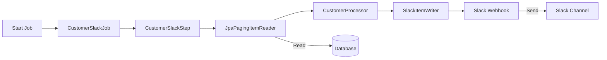
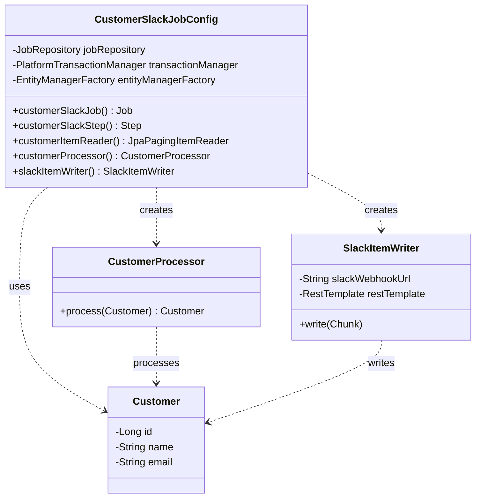
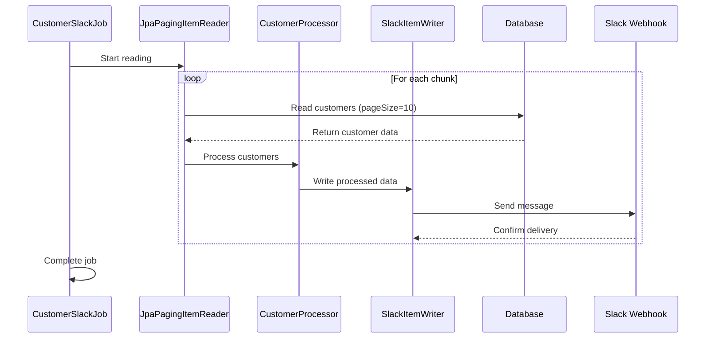

# Customer Batch Process Diagrams

## Batch Process Flow

```mermaid
graph LR
    A[Start Job] --> B[CustomerSlackJob]
    B --> C[CustomerSlackStep]
    C --> D[JpaPagingItemReader]
    D --> E[CustomerProcessor]
    E --> F[SlackItemWriter]
    F --> G[Slack Webhook]
    D --> |Read| H[(Database)]
    G --> |Send| I[Slack Channel]
```

## Class Diagram

```mermaid
classDiagram
    class CustomerSlackJobConfig {
        -JobRepository jobRepository
        -PlatformTransactionManager transactionManager
        -EntityManagerFactory entityManagerFactory
        +customerSlackJob() Job
        +customerSlackStep() Step
        +customerItemReader() JpaPagingItemReader
        +customerProcessor() CustomerProcessor
        +slackItemWriter() SlackItemWriter
    }
    
    class Customer {
        -Long id
        -String name
        -String email
    }
    
    class CustomerProcessor {
        +process(Customer) Customer
    }
    
    class SlackItemWriter {
        -String slackWebhookUrl
        -RestTemplate restTemplate
        +write(Chunk<Customer>)
    }
    
    CustomerSlackJobConfig ..> Customer : uses
    CustomerSlackJobConfig ..> CustomerProcessor : creates
    CustomerSlackJobConfig ..> SlackItemWriter : creates
    CustomerProcessor ..> Customer : processes
    SlackItemWriter ..> Customer : writes
```

## Component Interaction

```mermaid
sequenceDiagram
    participant Job as CustomerSlackJob
    participant Reader as JpaPagingItemReader
    participant Processor as CustomerProcessor
    participant Writer as SlackItemWriter
    participant DB as Database
    participant Slack as Slack Webhook

    Job->>Reader: Start reading
    loop For each chunk
        Reader->>DB: Read customers (pageSize=10)
        DB-->>Reader: Return customer data
        Reader->>Processor: Process customers
        Processor->>Writer: Write processed data
        Writer->>Slack: Send message
        Slack-->>Writer: Confirm delivery
    end
    Job->>Job: Complete job
``` 